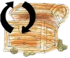

# Kalinowice (przygoda Małego Poszukiwacza Skarbów)

[English](README_en.md)

## Rozgrywka

1. Do gry potrzebna jest zainstalowana aplikacja (dostęp do internetu nie jest konieczny w czasie rozgrywki).
2. Poszukiwania można rozpocząć z dowolnego miejsca. Kolejność odkrywania poszczególnych punktów nie ma wpływu na wynik poszukiwań.
3. Wyboru konkretnej atrakcji, której chcemy szukać dokonać można po kliknięciu przycisku
   
   sugerując się np. bliską odległością od aktualnego położenia.
5. Podczas poszukiwań można skorzystać z mapy planując trasę poszukiwań. Mapa dostępna jest po naciśnięciu przycisku
   
6. Interesujące miejsca/obiekty odnajduje się na podstawie informacji o odległości wyrażonej liczbą kroków do wybranego punktu (wartość podana w lini prostej) oraz kompasu.
   Kompas wskazuje kierunek, którym trzeba podążać aby dotrzeć do skarbu.
   Jest to kierunek świata, poszukiwacz musi samodzielnie ustalić, gdzie jest północ żeby pójść we właściwą stronę.
7. Podczas poszukiwań można skorzystać z podpowiedzi dźwiękowej naciskając przycisk
    i/lub obejrzeć podpowiedź graficzną wybierając przycisk
   .
8. Po odnalezieniu kodu QR użyć należy aplikacji do zeskanowania kodu naciskając przycisk
    i dzięki temu można dowiedzieć się więcej o obiekcie lub miejscu oglądając przygotowany film.
9. W trakcie poszukiwań z każdym znalezionym skarbem można wykonać pamiątkowe zdjęcie naciskając przycisk
   .
10. Wybór kolejnego punktu dokonać należy ponownie z poziomu mapy..
    Odnaleziony wcześniej skarb powinien zostać oznaczony jako odnaleziony (można też samemu dokonać takiego zaznaczenia).
12. Zachęcamy do publikacji pamiątkowych zdjęć z trasy poszukiwań na Facebooku korzystając z przycisku
    

Życzymy udanej zabawy całym rodzinom.
   

## [Polityka Bezpieczeństwa](https://p-kalinowice-little-treasure-hunter.netlify.app/)
