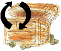

# Kalinowice (przygoda Małego Poszukiwacza Skarbów)

[English](README_en.md)

## Rozgrywka

1. Do gry potrzebna jest zainstalowana aplikacja (dostęp do internetu nie jest konieczny w czasie rozgrywki, ale przyda się podczas korzystania z mapy).
2. Poszukiwania można rozpocząć z dowolnego miejsca. Kolejność odkrywania poszczególnych skarbów wiedzy nie ma wpływu na wynik poszukiwań.
3. Wyboru konkretnego skarbu, którego chcemy szukać dokonać można po kliknięciu przycisku
    sugerując się np. bliską odległością od aktualnego położenia.
5. Podczas poszukiwań można skorzystać z mapy planując trasę poszukiwań. Mapa dostępna jest po naciśnięciu przycisku
   
6. Skarby wiedzy odnajduje się na podstawie informacji o odległości wyrażonej liczbą kroków do wybranego punktu (wartość podana w linii prostej) oraz kompasu.
   Kompas wskazuje kierunek świata, w którym trzeba podążać aby dotrzeć do skarbu.
   Poszukiwacz musi samodzielnie ustalić, gdzie jest północ żeby pójść we właściwą stronę.
   Kierunek i odległość są wyznaczane na podstawie wskazań GPS, trzeba więc mieć włączoną lokalizację w telefonie.
   Pamiętaj, że GPS ma ograniczoną dokładność, a czasami nawet popełnia błędy.
   Poszukiwacze mogą się wiec liczyć z tym, że czasami telefon będzie sugerował, że do skarbu który jest tuż obok pozostało jeszcze 100 kroków albo i więcej.
7. Podczas poszukiwań można skorzystać z podpowiedzi dźwiękowej naciskając przycisk
    i/lub obejrzeć podpowiedź graficzną wybierając przycisk
   .
8. Poszukiwane skarby wiedzy są reprezentowane kodami QR.
   Po odnalezieniu kodu QR użyć należy aplikacji do zeskanowania kodu naciskając przycisk
    i dzięki temu można dowiedzieć się więcej o obiekcie lub miejscu oglądając przygotowany film.
9. W trakcie poszukiwań można wykonać pamiątkowe zdjęcie, które zostanie powiązane z poszukiwanym skarbem naciskając przycisk
   .
10. Po odnalezieniu skarbu należy wybór kolejny cel poszukiwań.
    Odnaleziony wcześniej skarb powinien zostać automatycznie oznaczony jako odnaleziony.
12. Zachęcamy do publikacji raportu ze statystykami i pamiątkowymi zdjęciami z trasy poszukiwań na Facebooku korzystając z przycisku
    
13. Wszystkie odblokowane filmy dla odkrytych skarbów wiedzy można odtwarzać wielokrotnie za pomocą przycisku
     umieszczonego na widoku z listą skarbów.

### Pamiętaj

Rozgrywka odbywa się w terenie, po ulicach będą jeździć samochody...
Zachowaj ostrożność.
Wskazania kompasu nie zwalniają z obowiązku przestrzegania przepisów ruchu drogowego.
Na Twojej drodze mogą pojawiać się przeszkody, nie zawsze będzie można podążać prostą drogą do skarbu.
Dzieci powinny brać udział w rozgrywce pod opieką dorosłych.
Ostatecznie jednak każdy ze skarbów znajduje się w publicznie dostępnym miejscu.

**Życzymy udanej zabawy całym rodzinom.**

## O aplikacji

Gra jest projektem rodzinnym:
- Andrzej Legrand (dziadek) był źródłem bezcennej wiedzy o Kalinowicach o których opowiada nam w dostępnych w aplikacji filmikach.
- Alina Legrand-Jureczko (mama) zadbała o jakość gry i przygotowała instrukcję obsługi.
- Marian Jureczko (tata) zaprogramował grę.
- Ala Jureczko (córka) przygotowała obrazki wykorzystane jako grafika w grze.
- Zosia Jureczko (córka) nagrywała podpowiedzi i pomagała siostrze z grafiką.
- Antoni Legrand (wujek) dzięki niemu mamy zamontowane na terenie Kalinowic tabliczki z kodami QR. 

## [Polityka Bezpieczeństwa](https://p-kalinowice-little-treasure-hunter.netlify.app/)
