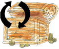
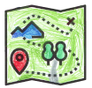
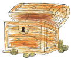

# Kalinowice (Adventure of the Little Treasure Hunter)

[Polski](README.md)

## How to Play

1. You need to install an app to play the game. You don’t need the internet while playing, but it helps when using the map.
2. You can start the treasure hunt from anywhere! It doesn’t matter which treasure you look for first.
3. To choose a treasure to search for, tap this button:  
     
   Try picking one that’s close to where you are!
4. You can use the map to plan your path by tapping this button:  
   
5. Treasures are hidden using clues like how many steps away they are (in a straight line) and a compass.  
   The compass shows which direction to go.  
   You’ll have to figure out where north is to follow the compass properly!  
   Make sure your phone’s location (GPS) is turned on.  
   Remember, GPS isn’t always perfect—sometimes it might say the treasure is far even if it's right next to you.
6. Need help?  
   You can hear a hint by tapping:  
     
   Or see a picture hint by tapping:  
   
7. Treasures are shown as QR codes.  
   When you find one, scan it with the app by tapping:  
     
   You’ll get to watch a cool video and learn something new!
8. Want to take a memory photo during the search?  
   Tap this button:  
     
   The photo will be saved with the treasure you were hunting!
9. After you find a treasure, pick a new one to search for.  
   The app will mark treasures you already found.
10. Share your adventure on Facebook with your photos and stats by tapping:  
    
11. You can watch the treasure videos again anytime by going to the treasure list and tapping:  
    

### Remember

You’re playing outside, and cars will be on the roads...  
Be careful!  
The compass won’t keep you safe—**you must follow traffic rules!**  
Sometimes you’ll find obstacles and won’t be able to walk in a straight line.  
Kids should always play with an adult.

All treasures are in public places, so you don’t need to go anywhere private.

**Have fun with your whole family!**

## About the App

This game was made by a family:

- Andrzej Legrand (grandpa) shared amazing stories about Kalinowice. You can watch him in the videos!
- Alina Legrand-Jureczko (mom) assured quality and wrote the instructions.
- Marian Jureczko (dad) made the app work with his programming skills.
- Ala Jureczko (daughter) drew the pictures in the game.
- Zosia Jureczko (daughter) recorded hints and helped her sister with the artwork.
- Antoni Legrand (uncle) put up all the QR code signs around Kalinowice!

## [Safety Policy](https://p-kalinowice-little-treasure-hunter.netlify.app/#/README_en)
