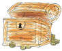
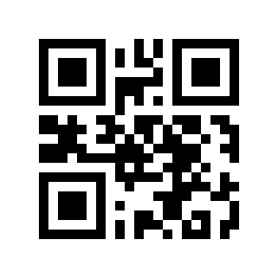

# Mały Poszukiwacz Skarbów

[English](README_en.md)

## Rozgrywka

1. Do gry potrzebne są wydrukowane kody QR, które posłużą jako skarby.
   Można wygenerować własne na podstawie instrukcji [poniżej](#skarby) albo użyć dostępnych na dole strony.

2. Przygotowanie do poszukiwań wymaga ukrycia skarbów:
    * Należy wybierać `Nowa trasa` i wprowadzić jej nazwę, dowolną.
    * Trzeba ukryć skarby, czyli wydrukowane wcześniej kody QR.
    * W miejscu ukrycia skarbu należy wcisnąć przycisk z wizerunkiem skrzyni .
      Dzięki temu gra zapamięta współrzędne skarbu.
    * Dodatkowo można nagrać podpowiedź dla poszukiwaczy przez naciśnięciu przycisku z symbolem mikrofonu lub zrobić sugerujące lokazliację skarbu zdjęcie naciskając przycisk z symbolem aparatu.

3. Gdy już wszystkie skarby są ukryte należy wycofać się do głównego ekranu gry, wybrać właśnie utworzoną trasę i przekazać telefon poszukiwaczom.

4. Poszukiwacze szukają na podstawie informacji o odległości wyrażonej liczbą kroków do skarbu i kompasu.
   Kompas wskazuje kierunek, którym trzeba podążać aby dotrzeć do skarbu.
   Jest to kierunek świata, poszukiwacz musi samodzielnie ustalić gdzie jest północ żeby pójść we właściwą stronę.

5. Podczas poszukiwań można skorzystać z podpowiedzi nagranej wcześniej przez ukrywającego skarby naciskając przycisk
    lub obejrzeć zdjęcie wybierając przycisk
   .

6. Poszukiwacz po znalezieniu skarbu używa aplikacji do zeskanowania kodu QR naciskając przycisk
    i dzięki temu dowiaduje się co znalazł.

7. Po znalezieniu skarbu można wybrać do poszukiwań kolejny przy pomocy przycisku
   .
   
## Skarby

Skarby są reprezentowane przy pomocy kodów QR.
Kod powinien być zgodny z formatem TDDWWW (wyrażenie regularne: [grd]\d\d\w\w\w), np: g01abc.

* T - określa typ skarbu, g to złoto, r rubiny, d diamenty,

* DD - ilość skarbu, powinna to być liczba z przedziału od 01 do 99,

* WWW - identyfikator skarbu, każdy skarb powinien mięc przypisaną inną wartość.

Kody QR można wygenerować na stronie (https://zxing.appspot.com/generator) albo użyć poniższych:
* * *

* * *