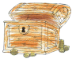
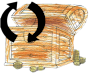

# Mały Poszukiwacz Skarbów

[English](README_en.md)

## Rozgrywka

1. Do gry potrzebne są wydrukowane kody QR, które posłużą jako skarby.
   Można wygenerować własne na podstawie instrukcji [poniżej](#skarby) albo użyć dostępnych na dole strony.

2. Przygotowanie do poszukiwań wymaga ukrycia skarbów:
    * Należy wybierać `Nowa trasa` i wprowadzić jej nazwę, dowolną.
    * Trzeba ukryć skarby, czyli wydrukowane wcześniej kody QR.
    * W miejscu ukrycia skarbu należy wcisnąć przycisk z wizerunkiem skrzyni .
      Dzięki temu gra zapamięta współrzędne skarbu.
    * Dodatkowo można nagrać podpowiedź dla poszukiwaczy przez naciśnięcie przycisku z symbolem mikrofonu lub zrobić sugerujące lokalizację skarbu zdjęcie naciskając przycisk z symbolem aparatu.

3. Gdy już wszystkie skarby są ukryte należy wycofać się do głównego ekranu gry, wybrać właśnie utworzoną trasę i przekazać telefon poszukiwaczom.

4. Poszukiwacze szukają na podstawie informacji o odległości wyrażonej liczbą kroków do skarbu i kompasu.
   Kompas wskazuje kierunek, którym trzeba podążać aby dotrzeć do skarbu.
   Jest to kierunek świata, poszukiwacz musi samodzielnie ustalić, gdzie jest północ żeby pójść we właściwą stronę.

5. Podczas poszukiwań można skorzystać z podpowiedzi nagranej wcześniej przez ukrywającego skarby naciskając przycisk
    lub obejrzeć zdjęcie wybierając przycisk
   .

6. Poszukiwacz po znalezieniu skarbu używa aplikacji do zeskanowania kodu QR naciskając przycisk
    i dzięki temu dowiaduje się co znalazł.

7. Po znalezieniu skarbu można wybrać do poszukiwań kolejny skarb przy pomocy przycisku
   .
   
## Skarby

Skarby są reprezentowane przy pomocy kodów QR.
Kod powinien być zgodny z formatem TDDWWW (wyrażenie regularne: [grd]\d\d\w\w\w), np: g01abc.

* T - określa typ skarbu, g to złoto, r rubiny, d diamenty,

* DD - ilość skarbu, powinna to być liczba z przedziału od 01 do 99,

* WWW - identyfikator skarbu, każdy skarb powinien mięc przypisaną inną wartość.

Kody QR można wygenerować na stronie (https://zxing.appspot.com/generator) albo użyć poniższych:
* * *

* * *

## Osiągnięcia

Za szczególne osiągnięcia w odkrywaniu kolejnych skarbów przyznawane są odznaki.
Łączą się z osiągnięciami i odznakami uzyskanymi w pozostałych aplikacjach z serii:
- [Kalinowice](https://play.google.com/store/apps/details?id=pl.marianjureczko.poszukiwacz.kalinowice)
- [Pęgów](https://play.google.com/store/apps/details?id=pl.marianjureczko.poszukiwacz.pegow)

Zagraj we wszystkie gry aby zdobyć odznaki najwyższego poziomu!

Odznaki są przyznawane w aż 8 kategoriach:
-   Poszukiwacz Złota - liczy się suma sztuk złota z kodów QR reprezentujacych złoto.
-   Odkrywca Diamentów - łączna liczba diamentów ze skarbów zawierających diamenty.
-   Kolekcjoner Rubinów - ile zdobyto rubnów w zeskanowanych kodach QR.
-   Bohater Wiedzy - liczba zeskanowanych kodów QR pod którymi ukrywały się filmiki z ciekawostkami.
-   Skarbnik - liczy się suma zebranych wszystkich rodzajów kosztowności.
-   Poszukiwacz Skarbów - tu ważna jest łączna liczba odkrytych skarbów, dowolnego rodzaju.
-   Wytrwały Podróżnik - wytrwałość wykazuje się liczbą tras na których znaleziono wszystkie skarby.
-   Tropiciel Szlaków - liczy się rekord w liczbie skarbów znalezionych na jednej, ukończonej trasie.

W każdej kategorii można zdobyć wiele odznak.
Wraz ze wzratającą w danej kategorii liczbą punktów przyznawany będzie coraz wyższy poziom odznaki.

## [Polityka Bezpieczeństwa](https://policy-little-treasure-hunter.netlify.app/#/)
